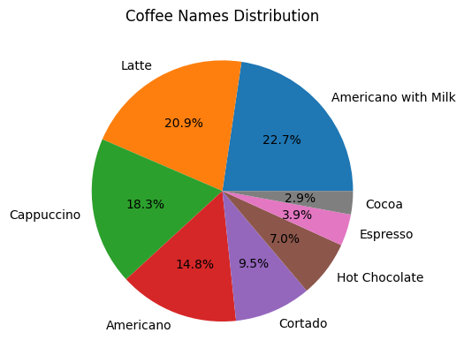
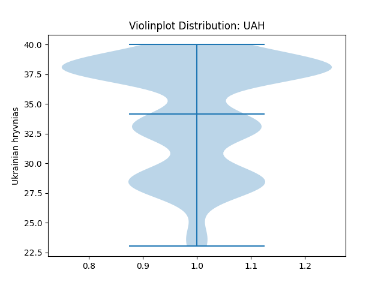
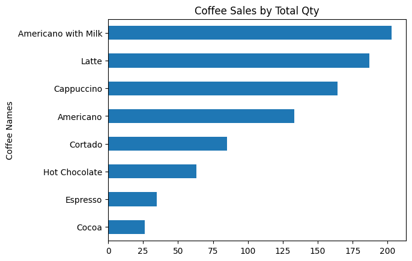
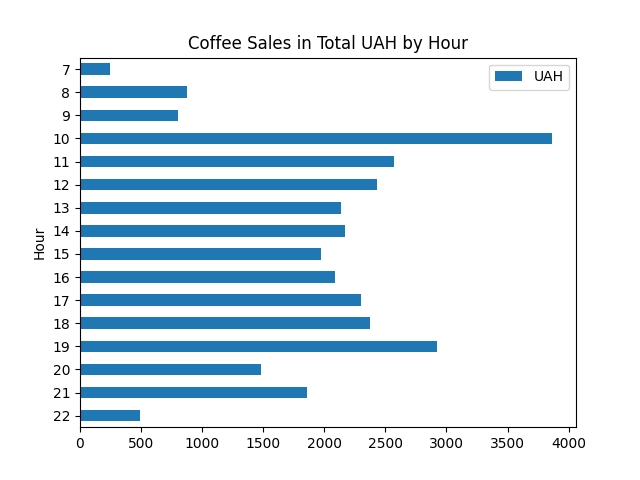
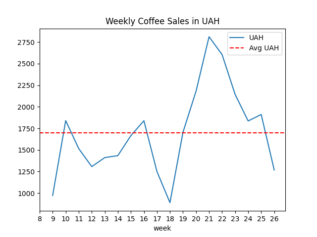
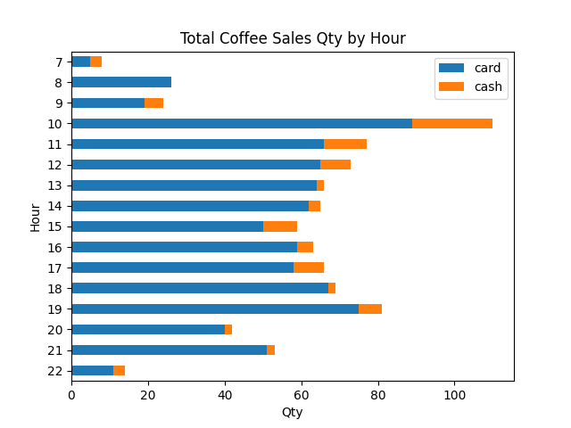
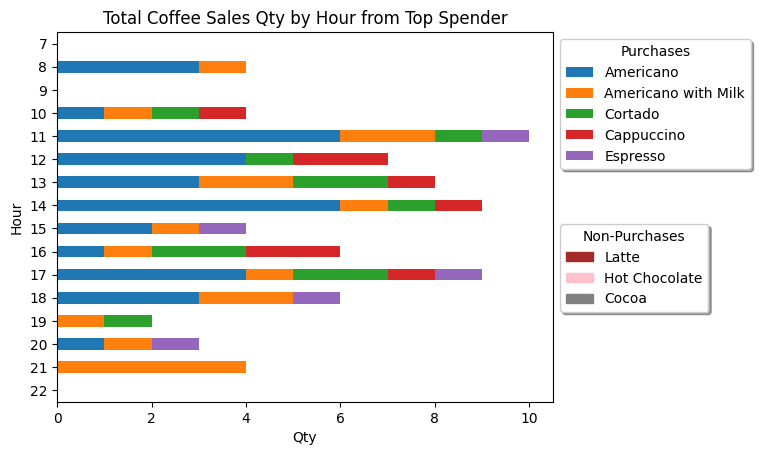

Project Summary:
1. Practice extensive data analysis and visualization.
2. Practice asking relevant business questions:
    * What are the most popular coffees?
    * What time of day has the most sales?
    * What is the distribution of coffee type for that time of day in Q2?
    * What is the average weekly sale?
    * Which day of the week has most sales?
    * What time of day has the most cash sales?
    * What are the spending habits of the top spender?

|File|Description|
|-|-|
|[Coffee_Sales.csv](index.csv)|CSV file which contains the coffee sales data|
|[Coffee_Sales.ipynb](Coffee_Sales.ipynb)|Jupyter notebook which contains the steps to achieve the visualizations below|

<table>
    <thead>
        <tr>
            <th colspan=3>Visualization</th>
        </tr>
    </thead>
    <tbody>
        <tr>
            <td></td>
            <td></td>
            <td></td>
        </tr>
        <tr>
            <td></td>
            <td></td>
            <td></td>
        </tr>
        <tr>
            <td></td>
            <td></td>
            <td></td>
        </tr>
    </tbody>
</table>
