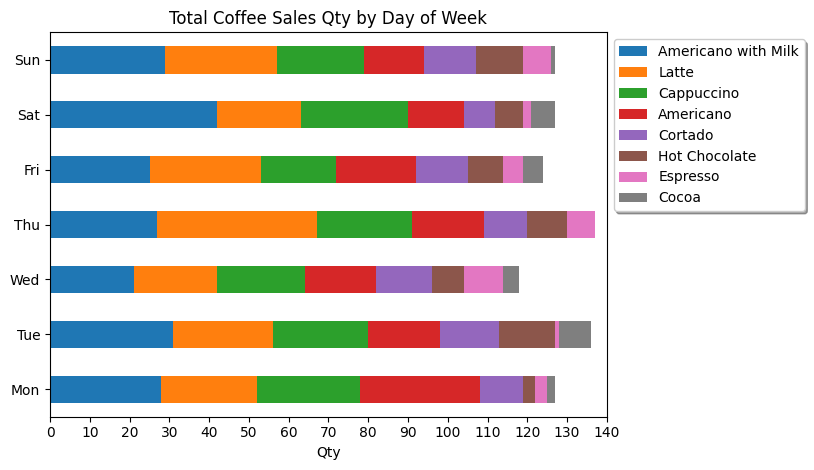

|File|Description|
|-|-|
|[Coffee_Sales.csv](index.csv)|CSV file which contains the coffee sales data|
|[Coffee_Sales.ipynb](Coffee_Sales.ipynb)|Python notebook which contains the steps to achieve the visualizations below|

Business questions:
1. What are the most popular coffees?
2. What time of day has the most sales?
3. What is the distribution of coffee type for that time of day in Q2?
4. What is the average weekly sale?
5. Which day of the week has most sales?
6. What time of day has the most cash sales?
7. What are the spending habits of the top spender?

<table>
    <thead>
        <tr>
            <th colspan=3>Visualization</th>
        </tr>
    </thead>
    <tbody>
        <tr>
            <td></td>
            <td></td>
            <td></td>
        </tr>
        <tr>
            <td></td>
            <td></td>
            <td></td>
        </tr>
        <tr>
            <td></td>
            <td></td>
            <td></td>
        </tr>
    </tbody>
</table>
